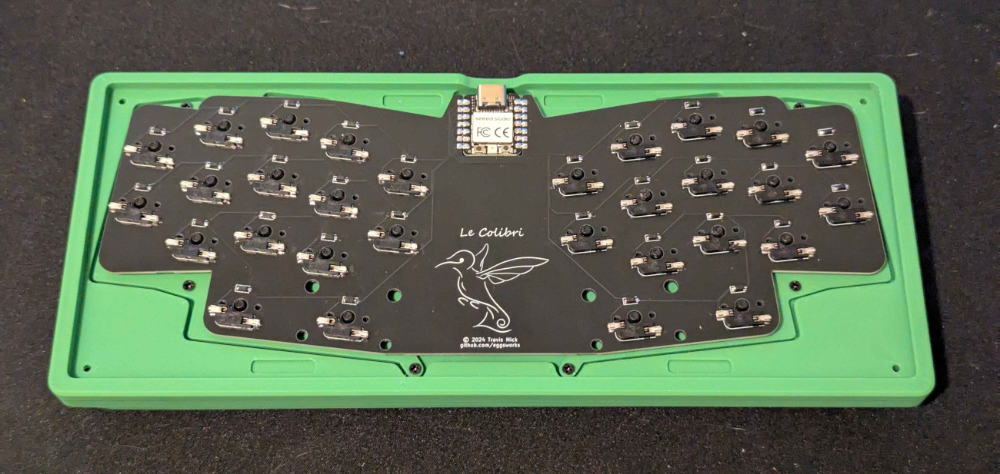

# le colibri

Le Colibri is a 30-key unibody split keyboard inspired by Le Chiffre and the Hummingbird.

## Disclaimer

This keyboard came to me in a dream so I had to bring it into the waking world. It is not necessarily good. But here it is.

## FAQ

**Why not just [chiffchaff](https://github.com/kilipan/chiffchaff)?**  
Like I said, this keyboard was designed in a dream. The dreamt keyboard was not chiffchaff but something much worse, which you see here.

**Can I use a regular Chiffre case or PCB?**  
No, it is basically completely incompatible. See *Case* section below.

## BOM

- 30x SOD-123 1N4148 diodes
- 30x Kailh MX hotswap sockets
- One Seeduino XIAO (designed for RP2040, but will work with others -- maybe you can even make it wireless if you bodge a battery onto the NRF one!)

## Case

The switchplates are obviously incompatible with a normal Chiffre. The in-plane XIAO makes this keyboard incompatible with the bottom case. And the reduced number of keys would make it dumb to use the top, unless you like huge gaps. Custom case files can be found in [case/](case/).

Screw the switchplate into the case before putting any switches in it - the PCB blocks a couple of the holes.

The only support needed during printing is on the bottom case, near the outer edges of the screw holes.

## Firmware

Firmware is available in the [eggsworks zmk-config repo](https://github.com/eggsworks/zmk-config/).

## Assembly

1. Solder the Xiao, with components facing the back side of the board, as pictured here. The intend of mid-mounting the Xiao is to put the USB port at the same height as it is on a normal Le Chiffre PCB, so try to get it lined up such that the top of the Xiao PCB lines up with the bottom of the Le Colibri PCB.
2. Solder the diodes.
3. Solder the sockets.
4. Mount the switchplates to the top case using self-tapping M2 screws.
5. Insert switches in the sockets to secure the PCB to the case.
6. Flash firmware before closing up the bottom case.
7. Add the bottom case to the assembly and secure it with self-tapping M3 screws.

## Acknowledgements

- Inspired by the original [tominabox1/Le-Chiffre-Keyboard](https://github.com/tominabox1/Le-Chiffre-Keyboard/) and [PJE66/hummingbird](https://github.com/PJE66/hummingbird)
- MCU footprint derived from [ebastler/marbastlib](https://github.com/ebastler/marbastlib/)
- Layout derived from ergogen source supplied for [sporkus/le_capybara_keyboard](https://github.com/sporkus/le_capybara_keyboard)
- Logo by Sune
- Case modification by Donny
